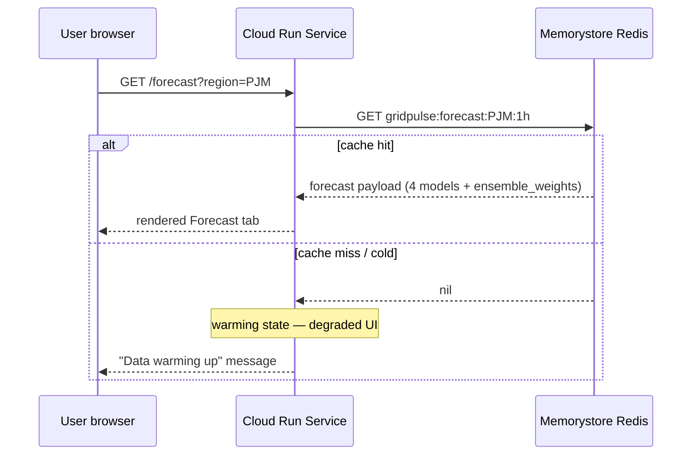
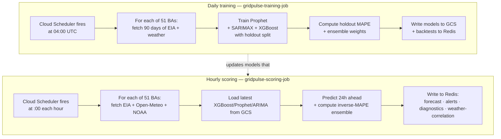
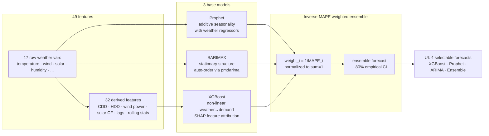
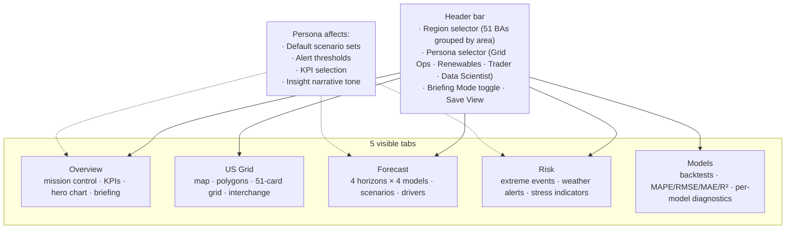

# How GridPulse Works

> A 5-minute read covering the architecture, runtime split, ML pipeline,
> and UI structure. Numbers cited here are anchored in
> [`CANONICAL_FACTS.md`](CANONICAL_FACTS.md) — when they change there,
> they change here too.

GridPulse is an **energy intelligence platform**: weather-aware electricity demand forecasting plus the supporting context (grid generation, severe-weather alerts, scenario simulation, model validation) for **51 US balancing authorities** covering ~100% of contiguous-US lower-48 load. The product surface is a Dash/Plotly web app; the operational machinery is a small set of Cloud Run services and scheduled jobs.

The design principle that shapes everything below: **the web tier never does heavy work in the request path.** Cache misses degrade gracefully to a "warming" state instead of triggering inline model loads or third-party API calls. All the expensive work — fetching data from EIA / Open-Meteo / NOAA, training models, computing forecasts — happens out-of-band in scheduled jobs that write to Redis. The web service reads only.

## §1 — System architecture

Three runtime tiers plus four external data sources. The boundary that matters is `REQUIRE_REDIS` — when true (staging + production), web callbacks short-circuit to the warming state rather than fetching live data themselves.

```mermaid
flowchart LR
    subgraph External["External APIs"]
        EIA[EIA API v2<br/>demand · generation · interchange]
        OM[Open-Meteo<br/>17 weather vars]
        NOAA[NOAA NWS<br/>severe alerts]
    end

    subgraph GCP["Google Cloud Platform"]
        CS[Cloud Scheduler<br/>hourly + daily 04:00 UTC]
        subgraph Jobs["Cloud Run Jobs"]
            SJ[gridpulse-scoring-job<br/>hourly]
            TJ[gridpulse-training-job<br/>daily]
        end
        Redis[(Memorystore Redis<br/>gridpulse:* namespace)]
        GCS[(GCS bucket<br/>models/{region}/{model}/)]
        subgraph Web["Cloud Run Service"]
            App[gridpulse<br/>Dash/Flask web tier]
        end
    end

    CS -- triggers --> SJ
    CS -- triggers --> TJ
    SJ -- fetch --> EIA
    SJ -- fetch --> OM
    SJ -- fetch --> NOAA
    TJ -- fetch --> EIA
    TJ -- fetch --> OM
    SJ -- read models --> GCS
    TJ -- write models --> GCS
    SJ -- write forecasts/alerts --> Redis
    TJ -- write backtests --> Redis
    App -- read only --> Redis
    User((User browser)) <-- HTTPS --> App
    APIClient((API client)) -- GET /api/v1/* --> App
```

**HTTP surfaces on the web tier:** the Dash UI, `/health` (+ `?deep=1`),
`/metrics`, and since #250 a **public read-only JSON API** at `/api/v1` —
index, `/regions`, `/forecast/{region}?horizon=` (capped at 168h, the
weather-driven week), `/grid/summary`, `/drift/{region}`. The API reads the
same `gridpulse:*` Redis keys as the UI (same warming semantics: cold cache →
`503 {"status": "warming"}`, never fabricated data; unknown region → 404) and
exports fields by allow-list only. See the README "Public API" section for
curl examples.

**Why this split:** scoring + training are *expensive* (~5 min and ~3 hr for 51 BAs respectively) and *don't need to be interactive*. Putting them in Cloud Run **Service** would force every web request to wait on them — or rely on a background-thread hack that doesn't survive container recycles. Cloud Run **Jobs** are purpose-built for batch work with proper retries and 5-hour timeouts.

## §2 — Request lifecycle (what happens when a user loads the Forecast tab)



The web service is **stateless and idempotent**. It never fetches from EIA, Open-Meteo, NOAA, or trains a model in the request path. If Redis is cold (first deploy, post-flush, between scoring runs), the UI renders a degraded "warming" state instead of blocking the user on a 30-second model load. The next scheduled scoring run repopulates Redis and the next request succeeds.

This separation is the single biggest reliability decision in the project. It means the web tier survives any failure of the external data sources — they fail asynchronously in the scoring job, not in the user's tab.

## §3 — Scoring + training pipelines

Two jobs, two cadences, two outputs.



Hourly scoring runs **~14 minutes** for all 51 BAs and produces fresh forecasts within ~90 minutes of any new EIA-published actual. Daily training runs **~3 hours** (recently bumped to a 5-hour Cloud Run task timeout after measuring) and refreshes the inverse-MAPE ensemble weights based on the most recent week's holdout performance.

The atomic pointer for "which model is current" is `gs://.../models/{region}/{model}/latest.json`. Training writes the new version and updates `latest.json` last; scoring reads `latest.json` on every tick. Rollback is as simple as editing `latest.json` to point at an older version.

## §4 — Model architecture

Three base models, one ensemble, four selectable forecasts in the UI.



The ensemble is **1/MAPE weighted** — the model with the lowest recent holdout MAPE gets the highest weight, normalized to sum to 1. This was chosen over stacking (ADR-004) because it's self-correcting (a degrading model down-weights automatically), bounded (the ensemble can never be worse than the worst individual model), and trivial to debug ("which model is dominating right now and why").

A real example from the 2026-05-01 training run for FPL: `{xgboost: 0.578, prophet: 0.293, arima: 0.130}`. XGBoost wins because it captures the weather→cooling-load relationship FPL is dominated by; ARIMA gets a small allocation because Florida demand has a strong stationary daily cycle worth capturing.

The known limitation surfaced 2026-05-19: holdout MAPE is computed at training time, so the weights stay frozen between trainings. Between-training drift (model A degrades on live actuals while model B holds steady) isn't detected. Closing that gap is [#121 Model drift monitoring](https://github.com/kristenmartino/gridpulse/issues/121).

**Forecast horizon and the day-16 boundary.** The scoring job produces a **30-day** demand forecast at hourly granularity (`FORECAST_HORIZON_HOURS = 720`). Open-Meteo's free `/forecast` endpoint covers the first **16 days** (384 hours) with actual weather forecast values. For the remaining days 17-30, the future-feature builder falls back to **per-(hour-of-day, day-of-week) climatological group means** from the last 92 days of history. The Forecast tab renders a visible day-16 divider on the 30-day chart with labels ("← Open-Meteo forecast" / "climatology baseline →") so users can correctly interpret the regime split — the demand forecast past day 16 reflects seasonal/diurnal patterns, not forward-looking signal. The decision and alternatives considered are documented in ADR-008 (PRD.md §10). Atmospheric chaos limits deterministic NWP skill to ~10-14 days regardless of model, so climatology is the right answer past Open-Meteo's coverage rather than a cost-driven hack.

## §5 — UI structure

Five tabs, four personas, one region. Adapts presentation to the user role without changing the underlying data.



The shell was reduced from **9 tabs originally to 5 visible** in the R3 redesign. The five remaining tabs absorbed content from the deprecated ones (Historical Demand → Forecast, Backtest → Models, Generation/Weather/Simulator → cross-cutting sections inside the visible tabs).

Persona selection doesn't change the data — it changes the *defaults* and the *emphasis*. A trader and a grid operator looking at the same PJM forecast see different KPI selections, different default scenarios pre-populated in the simulator, and different alert thresholds — but the underlying demand series and ensemble forecast are identical.

## What's next

The pieces above describe the **portfolio-grade complete** state shipped through 2026-05-20. The next investment shifts focus from "is the architecture sound" to "are the models continuously calibrated" — see [STATUS.md](../STATUS.md) for current focus and [#121](https://github.com/kristenmartino/gridpulse/issues/121) for the model drift monitoring scope.

## Anchor numbers (verbatim recall)

Pulled from [`CANONICAL_FACTS.md`](CANONICAL_FACTS.md):

- 51 US balancing authorities (~100% of contiguous-US lower-48 load)
- 3 base ML models (Prophet, SARIMAX, XGBoost) + 1 inverse-MAPE weighted ensemble
- 4 user-selectable forecasts in the UI (the 3 base + the ensemble)
- 49 features (17 raw weather + 32 derived)
- Hourly scoring + daily training at 04:00 UTC
- Redis-only reads in the web tier; degraded warming state when cold
- 63 EIA-930 BAs in the contiguous US — we cover 51 of them (~81% by BA count, ~100% by demand-weighted load)
