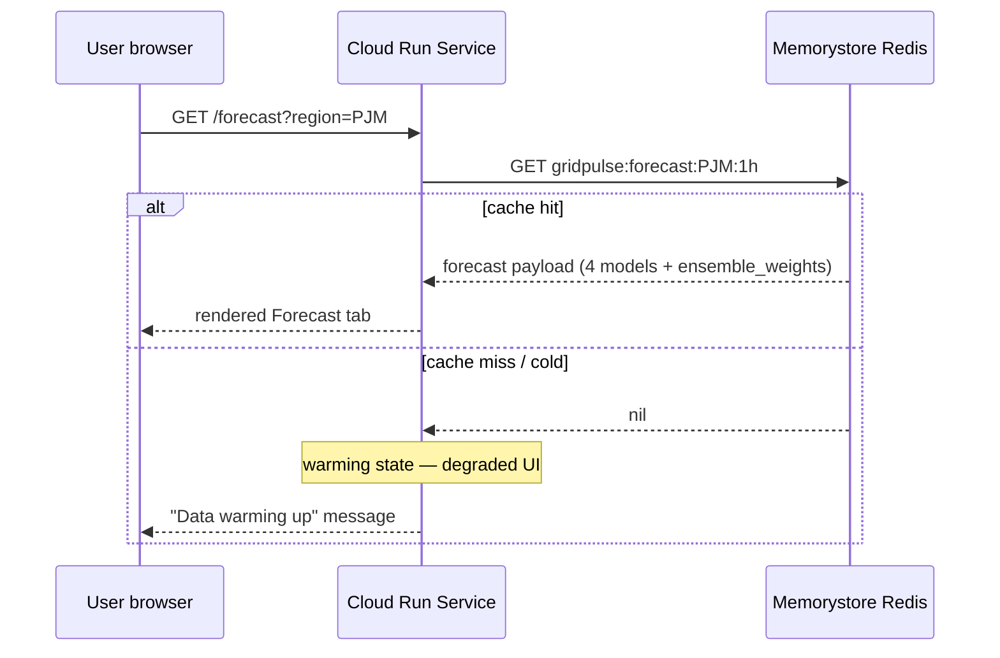
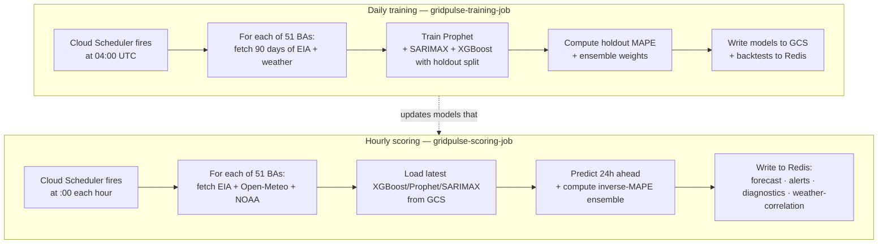
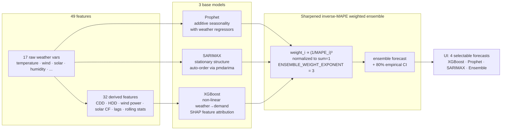
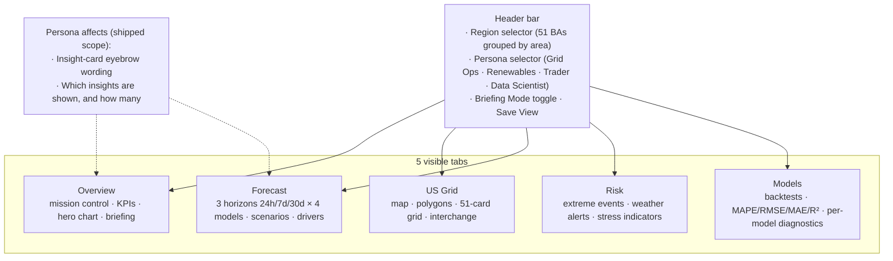

# How GridPulse Works

> A 5-minute read covering the architecture, runtime split, ML pipeline,
> and UI structure. Numbers cited here are anchored in
> [`CANONICAL_FACTS.md`](CANONICAL_FACTS.md) — when they change there,
> they change here too.

GridPulse is an **energy intelligence platform**: weather-aware electricity demand forecasting plus the supporting context (grid generation, severe-weather alerts, scenario simulation, model validation) for **51 US balancing authorities** covering ~100% of contiguous-US lower-48 load. The product surface is a Dash/Plotly web app; the operational machinery is a small set of Cloud Run services and scheduled jobs.

The design principle that shapes everything below: **the web tier never does heavy work in the request path.** Cache misses degrade gracefully to a "warming" state instead of triggering inline model loads or third-party API calls. All the expensive work — fetching data from EIA / Open-Meteo / NOAA, training models, computing forecasts — happens out-of-band in scheduled jobs that write to Redis. The web service reads only.

## §1 — System architecture

Three runtime tiers plus four external data sources. The boundary that matters is `REQUIRE_REDIS` — when true (staging + production), web callbacks short-circuit to the warming state rather than fetching live data themselves.

```mermaid
flowchart LR
    subgraph External["External APIs"]
        EIA[EIA API v2<br/>demand · generation · interchange]
        OM[Open-Meteo<br/>17 weather vars]
        NOAA[NOAA NWS<br/>severe alerts]
    end

    subgraph GCP["Google Cloud Platform"]
        CS[Cloud Scheduler<br/>hourly + daily 04:00 UTC]
        subgraph Jobs["Cloud Run Jobs"]
            SJ[gridpulse-scoring-job<br/>hourly]
            TJ[gridpulse-training-job<br/>daily]
        end
        Redis[(Memorystore Redis<br/>gridpulse:* namespace)]
        GCS[(GCS bucket<br/>models/{region}/{model}/)]
        subgraph Web["Cloud Run Service"]
            App[gridpulse<br/>Dash/Flask web tier]
        end
    end

    CS -- triggers --> SJ
    CS -- triggers --> TJ
    SJ -- fetch --> EIA
    SJ -- fetch --> OM
    SJ -- fetch --> NOAA
    TJ -- fetch --> EIA
    TJ -- fetch --> OM
    SJ -- read models --> GCS
    TJ -- write models --> GCS
    SJ -- write forecasts/alerts --> Redis
    TJ -- write backtests --> Redis
    App -- read only --> Redis
    User((User browser)) <-- HTTPS --> App
    APIClient((API client)) -- GET /api/v1/* --> App
```

**HTTP surfaces on the web tier:** the Dash UI, `/about` and `/benchmark`
(static pages served from `web/`), `/health` (+ `?deep=1`), `/metrics`,
`/robots.txt` and `/sitemap.xml` (generated by `seo.py`), and
since #250 a **public read-only JSON API** at `/api/v1` — index, `/regions`,
`/forecast/{region}?horizon=` (capped at 168h, the weather-driven week),
`/grid/summary`, `/drift/{region}`, `/benchmark` and `/benchmark/{region}`.
The `/benchmark` page carries no data of its own: it fetches
`/api/v1/benchmark` in the browser, so what it renders is exactly what the
public endpoint will admit to. Its rules, exclusions and limits are
[`docs/BENCHMARK_METHODOLOGY.md`](BENCHMARK_METHODOLOGY.md).

**Anything else 404s, and that took work.** Dash registers a `<path:path>`
catch-all pointed at its index, so until 2026-08-11 *every* unknown path
returned HTTP 200 and the full app shell — `/robots.txt`, `/wp-admin`,
anything. `seo.register_not_found_guard` fires only on requests whose URL
matched that catch-all, i.e. matched nothing else, which is why it cannot
shadow a real route. `robots.txt` and `sitemap.xml` are **generated and
host-aware**: the Cloud Run `*.run.app` origin is live and unauthenticated
beside the custom domain, and it gets `Disallow: /` plus a sitemap that still
names only `config.PUBLIC_BASE_URL`.

The API reads the
same `gridpulse:*` Redis keys as the UI (same warming semantics: cold cache →
`503 {"status": "warming"}`, never fabricated data; unknown region → 404) and
exports fields by allow-list only. See the README "Public API" section for
curl examples.

**Web-tier operational guard (#253).** Because that surface is public and
`--allow-unauthenticated` on personal billing, the request path carries the
same operational discipline the jobs already had: per-IP Redis-backed rate
limiting on `/api/v1/*` + the Dash callback route (fail-open on any Redis
error — a limiter that failed closed would self-inflict the outage it exists to
prevent), a `MAX_CONTENT_LENGTH` body cap, and `/health` + `/metrics` gated so
public callers get liveness only (the detailed body — Redis state, last-scored,
cache counts — is behind the `METRICS_ALLOWED_IPS` allowlist). A billing budget,
a 5xx alert, a pinned-at-max alert, and an uptime check complete it
(`docs/monitoring/`).

**Why this split:** scoring + training are *expensive* (~14 min and ~3 hr for 51 BAs respectively) and *don't need to be interactive*. Putting them in Cloud Run **Service** would force every web request to wait on them — or rely on a background-thread hack that doesn't survive container recycles. Cloud Run **Jobs** are purpose-built for batch work with proper retries and 5-hour timeouts.

## §2 — Request lifecycle (what happens when a user loads the Forecast tab)

```mermaid
sequenceDiagram
    participant U as User browser
    participant W as Cloud Run Service
    participant R as Memorystore Redis
    U->>W: GET /forecast?region=PJM
    W->>R: GET gridpulse:forecast:PJM:1h
    alt cache hit
        R-->>W: forecast payload (4 models + ensemble_weights)
        W-->>U: rendered Forecast tab
    else cache miss / cold
        R-->>W: nil
        Note over W: warming state — degraded UI
        W-->>U: "Data warming up" message
    end
```

The web service is **stateless and idempotent**. It never fetches from EIA, Open-Meteo, NOAA, or trains a model in the request path. If Redis is cold (first deploy, post-flush, between scoring runs), the UI renders a degraded "warming" state instead of blocking the user on a 30-second model load. The next scheduled scoring run repopulates Redis and the next request succeeds.

This separation is the single biggest reliability decision in the project. It means the web tier survives any failure of the external data sources — they fail asynchronously in the scoring job, not in the user's tab.

**A scoring run can now finish partially, on purpose (2026-08-04).** It used to be all-or-killed: `run()` submitted all 51 BAs and, if Cloud Run hit the `--task-timeout` first, the process was SIGKILLed. That cost more than it sounds, because per-BA Redis writes are incremental but the run-level bookkeeping is not — on 2026-08-04 two killed ticks had *already scored ~49 of 51 BAs* and recorded none of it, since `write_meta("last_scored")` and the fleet rollup sit after the fan-out. `last_scored` went stale for ~2 hours over work that had been done. Past `SCORING_SOFT_DEADLINE_FRACTION` (0.85) of the timeout, workers now stop starting new BAs and return immediately, so the run drains its queue and always reaches its epilogue: freshness meta written (with `deadline_hit` and `regions_deadline_skipped`, so the state is disclosed rather than implied), fleet rollup done, an alertable `scoring_deadline_shed`, exit 0. Skipped BAs keep serving their previous forecast under its 24h Redis TTL — they age, they don't disappear. Three tiers guard the runtime: **0.70 warn** (`scoring_runtime_creep`), **0.85 shed**, 1.00 hard kill, which we should no longer reach.

## §3 — Scoring + training pipelines

Two jobs, two cadences, two outputs.

```mermaid
flowchart TB
    subgraph Hourly["Hourly scoring — gridpulse-scoring-job"]
        H1[Cloud Scheduler fires<br/>at :00 each hour]
        H2[For each of 51 BAs:<br/>fetch EIA + Open-Meteo + NOAA]
        H3[Load latest XGBoost/Prophet/SARIMAX<br/>from GCS]
        H4[Predict 24h ahead<br/>+ compute inverse-MAPE ensemble]
        H5[Write to Redis:<br/>forecast · alerts · diagnostics · weather-correlation]
        H1 --> H2 --> H3 --> H4 --> H5
    end

    subgraph Daily["Daily training — gridpulse-training-job"]
        D1[Cloud Scheduler fires<br/>at 04:00 UTC]
        D2[For each of 51 BAs:<br/>fetch 90 days of EIA + weather]
        D3[Train Prophet<br/>+ SARIMAX + XGBoost<br/>with holdout split]
        D4[Compute holdout MAPE<br/>+ ensemble weights]
        D5[Write models to GCS<br/>+ backtests to Redis]
        D1 --> D2 --> D3 --> D4 --> D5
    end

    Daily -. updates models that .-> Hourly
```

Hourly scoring runs **~14 minutes** for all 51 BAs and produces fresh forecasts within ~90 minutes of any new EIA-published actual. Daily training runs **~3 hours** (recently bumped to a 5-hour Cloud Run task timeout after measuring) and refreshes the inverse-MAPE ensemble weights based on the most recent week's holdout performance.

The atomic pointer for "which model is current" is `gs://.../models/{region}/{model}/latest.json`. Training writes the new version and updates `latest.json` last; scoring reads `latest.json` on every tick. Rollback is as simple as editing `latest.json` to point at an older version.

## §4 — Model architecture

Three base models, one ensemble, four selectable forecasts in the UI.

```mermaid
flowchart LR
    subgraph Input["49 features"]
        Raw[17 raw weather vars<br/>temperature · wind · solar · humidity · ...]
        Derived[32 derived features<br/>CDD · HDD · wind power · solar CF · lags · rolling stats]
    end

    subgraph Models["3 base models"]
        Prophet[Prophet<br/>additive seasonality<br/>with weather regressors]
        SARIMAX[SARIMAX<br/>stationary structure<br/>auto-order via pmdarima]
        XGB[XGBoost<br/>non-linear weather→demand<br/>SHAP feature attribution]
    end

    subgraph Ensemble["Sharpened inverse-MAPE weighted ensemble"]
        Weights["weight_i ∝ (1/MAPE_i)³<br/>normalized to sum=1<br/>ENSEMBLE_WEIGHT_EXPONENT = 3"]
        Combined[ensemble forecast<br/>+ 80% empirical CI]
    end

    Raw --> Derived
    Raw --> Prophet
    Raw --> SARIMAX
    Derived --> XGB
    Prophet --> Weights
    SARIMAX --> Weights
    XGB --> Weights
    Weights --> Combined

    Combined --> UI[UI: 4 selectable forecasts<br/>XGBoost · Prophet · SARIMAX · Ensemble]
```

The ensemble is **sharpened inverse-MAPE weighted** — weight ∝ (1/MAPE)³ (`config.ENSEMBLE_WEIGHT_EXPONENT`, ADR-004 refined via #181), so it follows the best recent model and blends meaningfully only when peers are genuinely close. This was chosen over stacking (ADR-004) because the weights are transparent and trivial to debug ("which model is dominating right now and why"). Its measured value is **error decorrelation, not dominance**: on the recursive 51-BA holdout the ensemble beats XGBoost-alone on 21 of 51 BAs (2026-08-07 run; see `docs/BACKTEST_RESULTS.md`, whose ensemble column is now scored out-of-sample) — a useful hedge where model errors decorrelate, not a guarantee of winning, and the k=3 sharpening exists precisely because plain 1/MAPE blending kept 15–30% weight on models running 3–5× worse than the leader.

A real example from the 2026-05-01 training run for FPL: `{xgboost: 0.578, prophet: 0.293, arima: 0.130}`. XGBoost wins because it captures the weather→cooling-load relationship FPL is dominated by; SARIMAX gets a small allocation because Florida demand has a strong stationary daily cycle worth capturing.

The known limitation surfaced 2026-05-19: holdout MAPE is computed at training time, so the weights stay frozen between trainings. Between-training drift (model A degrades on live actuals while model B holds steady) isn't detected. Closing that gap is [#121 Model drift monitoring](https://github.com/kristenmartino/gridpulse/issues/121).

**The anchor, and where it comes from (ADR-009).** Every forecast seeds its
autoregressive features (`demand_lag_1h` + 20 siblings) and SARIMAX's Kalman
origin from the newest demand reading in the fetched frame. Because EIA's
newest hour is never a finished measurement (it cycles stub → partial →
settled per Form EIA-930's mandated deadlines), the scoring job applies two
data-quality layers before the anchor forms: the **#315 artifact guard**
(gross partials NaN-coerced, disclosed on the tiles) and, for BAs the vintage
classifier marks **`broken`**, **anchor conditioning** — the trailing
unsettled hours are substituted with the BA's own hour-matched day-ahead
forecast on a forked frame that only the feature/forecast path reads. The
same artifact guard also runs in the **training job** (#326 arc hygiene),
where the excluded hours are additionally dropped from the training frame —
so partials never become training targets, holdout ground truth, or the
ADR-010 gate's reference/truth rows.
Measured basis: broken-class anchors averaged 58.2% wrong vs the day-ahead's
14.5% (`docs/ANCHOR_CONDITIONING_STUDY.md`); every other class keeps its
unmodified anchor because the same study showed substitution would not help
(churn) or would actively hurt (bulk). Tiles, drift, and alerts always read
the real, unconditioned data.

**The serve-path acceptance gate (ADR-010).** Retraining daily means
drawing a new model daily, and the draws are not all good: replaying every
persisted LDWP XGBoost vintage showed **~27% produce recursive forecasts
that collapse overnight demand** into a phantom regime — a failure the
published holdout cannot see, because it scores a freshly retrained model
on sliced historical rows rather than running the deployed candidate
through the future-frame + recursion path production actually uses
(`docs/FORECAST_DIVE_DIAGNOSIS.md`). So before the training job repoints
`latest.json`, it replays the candidate pickle through the **real serve
path** from three anchors: offset anchors are scored against settled truth,
the live anchor against the trailing week's floor and level. A candidate
that fails is still persisted (forensics) but the pointer stays on
yesterday's accepted model — stale-but-sane over fresh-but-insane, the same
principle the data layer applies when an API degrades.

**Which measurement decides visibility (#349).** Two different gates share
a word and are easy to confuse. ADR-010 above gates **which model gets
served** — a serve-path replay, and the sharper of the two instruments. The
*visibility* gate (`is_forecast_quality_acceptable`, `gridpulse:meta:gate_status`)
decides **which BAs appear in the product at all**, and it is judged on the
**training holdout** against the **7-day** band — deliberately the most
generous question available, because hiding a balancing authority is a heavy
act. As measured on 2026-07-28 it hides **none** of the 51.

The cost of that generosity is that the holdout answer can be far kinder
than the horizon the benchmark publishes: SEC sat at 6.96% holdout — well
inside the 22% rollback bar — while every served model graded `rollback` at
24h on the live serve path (ensemble 12.2%, arima 16.9%, xgboost 25.2%,
prophet 34.0%). Both numbers were right about their own question, and
nothing compared them.

Since #349 the bar has not moved — re-grading visibility on the 24h band
would have hidden 7 of 51 BAs, three of them within 0.7 points of the
threshold and so inside the noise — but the second opinion is computed every
tick (`live_horizon_verdict`), published beside the verdict as
`live_horizon`, exposed on `/api/v1/regions` as `operating_horizon_grade`
next to an explicit `quality_gate_measurement`, and logged as
`gate_live_horizon_disagreement` whenever a region passes the gate while
failing at the horizon we publish. For a BA served the seasonal-naive
baseline instead (`models/skill.py`), that grade describes the models rather
than the served series — which is precisely the evidence for the
substitution.

**Forecast horizon and the day-16 boundary.** The scoring job produces a **30-day** demand forecast at hourly granularity (`FORECAST_HORIZON_HOURS = 720`). Open-Meteo's free `/forecast` endpoint covers the first **16 days** (384 hours) with actual weather forecast values. For the remaining days 17-30, the future-feature builder drives the weather inputs from a per-BA **(day_of_year, hour) weather-normal** — a trailing ~10-year ERA5 "normal weather year" built nightly by the training job (#283), with a **seam anomaly-blend** so the current weather regime decays into the normal over ~5 days past the boundary, and the autoregressive demand features kept on recent data so the tail stays anchored to *current* load levels. Where a BA's normal artifact isn't backfilled yet, the builder falls back to the #281 **recent-28-day (hour, dow) climatology** (`CLIMATOLOGY_WINDOW_DAYS = 28`). The Forecast tab renders a visible day-16 divider on the 30-day chart with labels ("← Open-Meteo forecast" / "climatology baseline →") so users can correctly interpret the regime split — the demand forecast past day 16 reflects seasonal/diurnal patterns, not forward-looking signal. The decision and alternatives considered are documented in ADR-008 (PRD.md §10). Atmospheric chaos limits deterministic NWP skill to ~10-14 days regardless of model, so climatology is the right answer past Open-Meteo's coverage rather than a cost-driven hack.

**Where the weather is sampled (ADR-012).** A BA's demand responds to weather across its whole territory, but the fetch historically sampled a single representative point — for MISO, one spot in rural Illinois standing in for fifteen states. Since ADR-012 each BA's footprint is sampled at up to **12 static cells** (chosen offline from census population centres inside the BA polygon, committed as `assets/multipoint_coordinates.json`) and averaged. The study behind it (`docs/MULTIPOINT_WEATHER_STUDY.md`) measured **+1.14 sMAPE pts** — MISO +1.77, PJM +1.41, SPP +1.45, and ~0 for compact single-metro BAs, which keep their single point. It also measured population *weighting* as adding nothing over a plain average, so the aggregation is unweighted and needs no census data at runtime. Wind direction uses a circular mean (averaging 350° and 10° arithmetically would point the wind due south) and the ordinal WMO `weather_code` uses a mode rather than a mean. The whole path fails open to single-point at every seam — the #161 lesson.

**Which weather model feeds the forecast (ADR-011).** The base fetch is Open-Meteo's `best_match` — which the weather-model A/B study (`docs/WEATHER_MODEL_AB.md`) showed already resolves to the GFS+HRRR seamless blend for CONUS. On top of it, the **NBM composite** (flag `nbm_weather`) overlays NOAA's National Blend of Models for future hours: NBM temperatures measured 16–27% more accurate with ~zero bias, worth **+0.921 sMAPE pts** of demand accuracy replayed through the real serve path. The composite keeps base values for the five variables the studied arm base-filled (radiation ×3, surface pressure, 120 m wind), for any NBM null (its ~11.5-day horizon inside the 16-day frame), and for all past hours. It is enrichment-only and fail-open — an NBM outage degrades to the base fetch, never to the fallback chain — and, being one client-level change, scoring and training switch together.

**Why the deep-history leg is cached across job runs (#389).** The weather fetch is two calls, not one: the `/forecast` endpoint for recent-plus-future hours, and the ERA5 **archive** endpoint for the deep window `[today-92, today-5]` (#161 — sourcing deep history from `/forecast?past_days=92` silently lost most of its coverage and took down forecasts fleet-wide). That archive window is **fixed for a whole UTC day**, but Cloud Run Jobs get a fresh container per run, so the SQLite cache is cold every tick and the hourly scoring job re-downloaded the identical window 24 times a day, per BA. The segment is now persisted to GCS and re-served on subsequent ticks. **Coverage decides a hit, not a TTL** — the cached frame must span the requested days, so a window that has moved (the first tick of a new UTC day) misses and re-fetches, and the cache cannot serve a window other than the one asked for. That is safe because ERA5T is revised to final ERA5 on a ~2–3 month lag, never intra-day: a hit returns the same values the fetch would. It fails open at every seam — GCS down, blob missing, frame malformed all fall through to the untouched fetch path — behind the `weather_archive_cache` flag.

**Sizing it honestly, and why it ships dark.** This is a **`fetch`-phase reclaim, not a fix for the 2026-08-04 incident.** An earlier reading blamed ADR-012 for making this leg ~12× heavier and causing the runtime alert; the runtime record refutes that (daily medians are flat across the 07-22/07-23 flips, and the incident was EIA retry tax). `fetch` is **15.0% of worker time** (426.3s of 2,834.8s summed, 2026-08-05T20:06 — it was 13.0% of 5,131.0s before the climatology vectorisation shrank the denominator), and the archive leg is **measured at 294.0s summed — the largest leg of `fetch` at 42.6%**, ahead of `eia_demand` (175.3s). That corrects a 50–70s estimate that was low by 4.2–5.9× because it reasoned from payload bytes; at 6.1s/BA the cost is ERA5 server-side extraction, not transfer. It also corrects the claim that `fetch` is dominated by EIA — on that tick `fetch` is **~75% weather, ~25% EIA**. The flag was flipped ON 2026-08-07 on this measurement; the **saving** remains unverified, since a hit swaps the fetch for a GCS read that is not free.

So the phase now names its own legs, the way `forecast` does: `scoring_phase_rollup.fetch_substeps` splits `eia_demand` from `weather_forecast` / `weather_nbm` / `weather_archive`. **`weather_archive` is the entire case for this cache** — if it is small, the honest outcome is deleting the cache, not enabling it. The flag therefore ships **off** (the discipline ADR-011 and ADR-012 both used), and flag-off is byte-identical because the cache is simply never consulted. Once it is switched on, the comparison generates itself: the window moves at 00Z, so the **first tick of each UTC day is a forced cache miss and the other 23 are hits** — a within-day paired contrast on the same code, same BAs, an hour apart, repeating daily.

**Long-horizon sanity guard (#296).** SARIMAX total integration is capped at **d + D ≤ 1** (seasonal D=1 carries the daily cycle; d is pinned to 0) — a doubly-integrated fit extrapolates the training window's local weather trend as a permanent linear trend, which decayed SC/PSCO/PJM through 0 MW and grew BPAT ~2× across the 30-day view. Defense is layered: the training job runs a fit-time 720h check (degenerate structures refit with the safe default), and the scoring job validates **every served series (each model + the ensemble)** at 24h/168h/720h against a band around the trailing month's real demand (floor 0.5× recent min, ceiling 1.6× recent max, plus a sustained-drift check on ≥15-day slices; `config.LONG_HORIZON_GUARD_*`). A flagged series gets a `horizon_guard` entry in the forecast payload — the Forecast tab then **withholds that model at flagged horizons and says why** ("failed the long-horizon sanity guard") instead of drawing a degenerate line.

**SARIMAX order selection is univariate on purpose (#297).** `pmdarima`'s
stepwise search picks `(p,d,q)(P,D,Q,24)` from demand alone; the weather
regressors are deliberately withheld from the *search*, though the fitted
model always uses all five. This started as a bug — `exogenous=` is the
pmdarima 1.x spelling of `X`, and since `auto_arima` takes `**fit_args` the
kwarg was swallowed silently — but replaying both arms
(`docs/ARIMA_ORDER_EXOG_STUDY.md`, all 51 BAs) rejected the exog-aware search.
Not because it loses everywhere — 18 BAs improve, 20 worsen, 13 are unaffected
— but because the losses total **−61.7 sMAPE pts against +14.9 gained** (worst
single BA −19.18), at 2.7× the search cost: a heavier left tail for no expected
gain. The harm concentrates where the search **drops the seasonal MA term**
(those 14 BAs mean −2.99 vs −0.21 for the rest) — given the regressors, AIC
credits them for variance that term was carrying and prunes it; defensible
in-sample, wrong across 168 recursive hours. The behaviour was kept and the dead kwarg removed, so the
code now states the choice instead of stumbling into it.

Worth knowing operationally: the search runs **only on a cold cache**. The
training job reads the previous model's persisted order and skips it, then
re-persists — there is no invalidation path, so an order propagates
indefinitely and every live order was selected univariately.

## §5 — UI structure

Five tabs, four personas, one region. Adapts presentation to the user role without changing the underlying data.

```mermaid
flowchart TB
    Header["Header bar<br/>· Region selector (51 BAs grouped by area)<br/>· Persona selector (Grid Ops · Renewables · Trader · Data Scientist)<br/>· Briefing Mode toggle · Save View"]

    subgraph Tabs["5 visible tabs"]
        T1[Overview<br/>mission control · KPIs · hero chart · briefing]
        T2[US Grid<br/>map · polygons · 51-card grid · interchange]
        T3[Forecast<br/>3 horizons 24h/7d/30d × 4 models · scenarios · drivers]
        T4[Risk<br/>extreme events · weather alerts · stress indicators]
        T5[Models<br/>backtests · MAPE/RMSE/MAE/R² · per-model diagnostics]
    end

    Header --> T1
    Header --> T2
    Header --> T3
    Header --> T4
    Header --> T5

    Personas["Persona affects (shipped scope):<br/>· Insight-card eyebrow wording<br/>· Which insights are shown, and how many"] -.-> T1
    Personas -.-> T3
```

The shell was reduced from **9 tabs originally to 5 visible** in the R3 redesign. The five remaining tabs absorbed content from the deprecated ones (Historical Demand → Forecast, Backtest → Models, Generation/Weather/Simulator → cross-cutting sections inside the visible tabs).

Persona selection doesn't change the data — it changes the *emphasis*. A trader and a grid operator looking at the same PJM forecast see the same demand series, the same ensemble forecast, and the same KPI tiles; what differs is the insight card's eyebrow ("Market signal" vs "Operating summary") and which insights are surfaced, filtered by `persona_relevance` and capped by `_PERSONA_MAX_INSIGHTS` ([`components/insights.py`](../components/insights.py)).

**Shipped scope is narrower than the persona config implies.** `personas/config.py` also declares `kpi_metrics` and `alert_threshold` per persona, and `_build_persona_kpis` / `_build_overview_briefing` exist in `components/_callbacks_overview.py` — but none of them have a live call site: the KPI builders are re-exported only for tests, and `alert_threshold` is never read outside its own dataclass. All four personas also declare `default_tab="tab-overview"`, so the default-tab redirect is a no-op in practice. Do not describe persona switching as changing KPI selection, alert thresholds, or scenario sets until that code is wired up or deleted — tracked in [#188](https://github.com/kristenmartino/gridpulse/issues/188) (dead persona config).

## What's next

The pieces above describe the **portfolio-grade complete** state shipped through 2026-05-20. The next investment shifts focus from "is the architecture sound" to "are the models continuously calibrated" — see [STATUS.md](../STATUS.md) for current focus and [#121](https://github.com/kristenmartino/gridpulse/issues/121) for the model drift monitoring scope.

## Anchor numbers (verbatim recall)

Pulled from [`CANONICAL_FACTS.md`](CANONICAL_FACTS.md):

- 51 US balancing authorities (~100% of contiguous-US lower-48 load)
- 3 base ML models (Prophet, SARIMAX, XGBoost) + 1 inverse-MAPE weighted ensemble
- 4 user-selectable forecasts in the UI (the 3 base + the ensemble)
- 49 features (17 raw weather + 32 derived)
- Hourly scoring + daily training at 04:00 UTC
- Redis-only reads in the web tier; degraded warming state when cold
- 63 EIA-930 BAs in the contiguous US — we cover 51 of them (~81% by BA count, ~100% by demand-weighted load)
