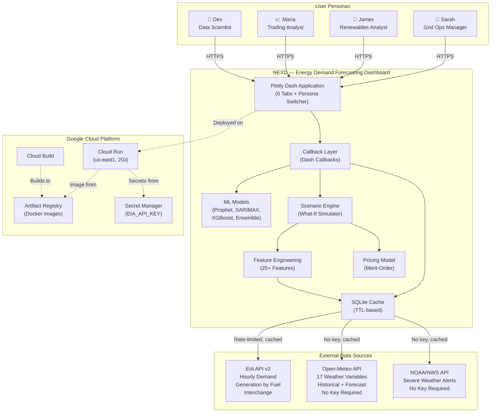
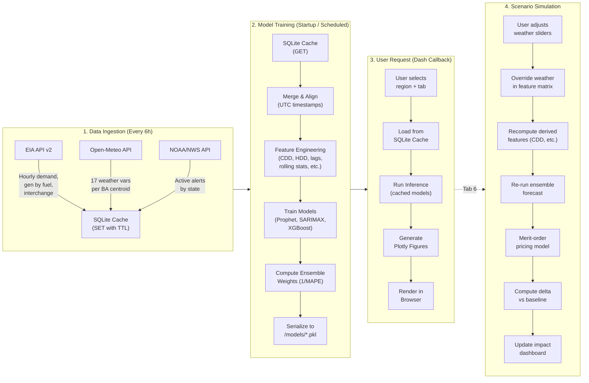

# Phase 0.1 — System Definition
## NextEra Energy Demand Forecasting Dashboard (NEXD)

> **Status:** Phase 0.1 Complete — Ready for Jira import, GitHub repo creation, and GCP provisioning.
> **Source Documents:** `nextera-portfolio-buildplan.md`, `project1-expanded-spec.md`, `energy-forecast-nextera-dashboard-backlog.md`
> **Date:** 2026-02-20

---

## 1. Product Requirements Document (PRD)

### 1.1 Problem Statement

Energy grid operators, renewable portfolio analysts, traders, and data scientists currently lack a unified, weather-aware forecasting tool that combines real grid data, meteorological features, and scenario simulation in a single view. Forecasts that don't account for weather cause demand spikes to catch operators off guard, renewable intermittency creates blind spots in market bidding, and no tool lets stakeholders stress-test the grid against hypothetical weather scenarios before they happen.

### 1.2 Product Vision

An interactive, weather-aware energy demand forecasting dashboard that combines real grid data (EIA) with meteorological features (Open-Meteo) to predict electricity demand across 8 U.S. balancing authorities. Demonstrates the exact intersection of weather science and energy optimization that is NextEra Analytics' core business.

### 1.3 Target Users (Personas)

| Persona | Role | Primary Goal | Default Tab | Key Metrics |
|---------|------|-------------|-------------|-------------|
| **Sarah** — Grid Operations Manager | Real-time grid operations at a regional BA | 24-72hr demand forecasts for generation scheduling | Tab 1: Demand Forecast | MAPE < 3%, peak timing, ramp rates |
| **James** — Renewable Portfolio Analyst | Manages wind/solar assets for a utility (like NextEra) | Forecast wind/solar generation for market bidding | Tab 4: Generation Mix | Capacity factor accuracy, curtailment events |
| **Maria** — Energy Trading Desk Analyst | Trades electricity futures and spot market | Identify demand-supply imbalances before price moves | Tab 5: Extreme Events | Price-demand correlation, extreme event detection |
| **Dev** — Data Scientist / ML Engineer | Builds and improves forecasting models | Compare model performance, evaluate features | Tab 3: Model Comparison | MAPE, RMSE, MAE, R², feature importance |

### 1.4 Core Requirements

#### R1 — Data Ingestion & Caching
| ID | Requirement | Priority | Source |
|----|------------|----------|--------|
| R1.1 | Ingest hourly demand, generation by fuel type, and interchange data from EIA API v2 for 8 balancing authorities (ERCOT, CAISO, PJM, MISO, NYISO, FPL, SPP, ISONE) | Must Have | Spec §Data Sources |
| R1.2 | Ingest 17 weather variables from Open-Meteo API for each BA centroid (historical + 7-day forecast) | Must Have | Spec §Data Sources |
| R1.3 | Ingest active severe weather alerts from NOAA/NWS API mapped to BAs via state lookup | Must Have | Spec §Data Sources |
| R1.4 | Cache all API responses to SQLite with configurable TTL (default 6 hours) | Must Have | Spec §Technical Architecture |
| R1.5 | Serve stale cache data when API is down, with warning badge | Must Have | Backlog G2 |
| R1.6 | Handle EIA rate limiting with exponential backoff | Must Have | Backlog D3 |
| R1.7 | Align EIA and Open-Meteo timestamps to UTC with gap handling (interpolate < 6h, flag > 6h) | Must Have | Spec AC-1.7, AC-1.8 |

#### R2 — Feature Engineering
| ID | Requirement | Priority | Source |
|----|------------|----------|--------|
| R2.1 | Compute CDD/HDD from temperature using 65°F baseline | Must Have | Spec §Derived Features |
| R2.2 | Compute wind power estimate using cubic relationship with mph→m/s conversion and cutout speed | Must Have | Spec §Derived Features |
| R2.3 | Compute solar capacity factor from GHI, clipped to [0, 1] | Must Have | Spec §Derived Features |
| R2.4 | Compute cyclical sin/cos encoding for hour-of-day and day-of-week | Must Have | Spec §Derived Features |
| R2.5 | Compute lag features (demand_t-24, demand_t-168) with no future data leakage | Must Have | Spec §Derived Features |
| R2.6 | Compute rolling statistics (24h/72h/168h mean, std, min, max) backward-looking only | Must Have | Spec §Derived Features |
| R2.7 | Compute temperature deviation from 30-day rolling average | Must Have | Spec §Derived Features |
| R2.8 | Compute temperature × hour interaction term | Must Have | Spec §Derived Features |
| R2.9 | Compute ramp rate (demand_t - demand_t-1) | Must Have | Spec §Derived Features |
| R2.10 | Detect US federal holidays via `holidays` library | Must Have | Spec §Derived Features |
| R2.11 | Final feature matrix: all numeric, no NaN, correct shape | Must Have | Spec AC-2.13, AC-2.14 |

#### R3 — Forecasting Models
| ID | Requirement | Priority | Source |
|----|------------|----------|--------|
| R3.1 | Prophet with weather regressors (temp, apparent temp, wind, solar, CDD, HDD, holiday) using multiplicative seasonality | Must Have | Spec §Model 1 |
| R3.2 | SARIMAX with exogenous weather variables, order auto-selected via pmdarima | Must Have | Spec §Model 2 |
| R3.3 | XGBoost with full feature set, validated via TimeSeriesSplit (no leakage) | Must Have | Spec §Model 3 |
| R3.4 | Weighted ensemble combining all models, weights inversely proportional to recent MAPE | Must Have | Spec §Model 4 |
| R3.5 | All models achieve MAPE < 10% on validation set | Must Have | Spec AC-3.8 |
| R3.6 | SHAP values computable for XGBoost feature importance | Must Have | Spec AC-3.10 |
| R3.7 | Models serialized to pickle, reload without error | Must Have | Spec AC-3.9 |
| R3.8 | Prophet uncertainty bands (80% and 95%) monotonically widening | Must Have | Spec AC-3.2 |

#### R4 — Dashboard UI (6 Tabs)
| ID | Requirement | Priority | Source |
|----|------------|----------|--------|
| R4.1 | **Tab 1 — Demand Forecast**: Actual vs forecast lines (5 traces), weather overlay toggle, peak demand card, accuracy scorecard, alerts panel, "now" marker | Must Have | Spec §Tab 1 |
| R4.2 | **Tab 2 — Weather-Energy Correlation**: Scatter plot matrix, correlation heatmap, feature importance bar chart, seasonal decomposition, renewable generation forecast | Must Have | Spec §Tab 2 |
| R4.3 | **Tab 3 — Model Comparison**: Model selector, metrics table (MAPE/RMSE/MAE/R²), residual analysis (4 plots), error by hour heatmap, error by weather, SHAP values | Must Have | Spec §Tab 3 |
| R4.4 | **Tab 4 — Generation Mix**: Stacked area by fuel type, renewable penetration %, wind vs wind speed, solar vs irradiance, duck curve, curtailment indicator, carbon intensity | Must Have | Spec §Tab 4 |
| R4.5 | **Tab 5 — Extreme Events**: NOAA alerts mapped to regions, demand anomaly detection, historical extremes timeline, temperature exceedance forecast, stress indicator | Must Have | Spec §Tab 5 |
| R4.6 | **Tab 6 — Scenario Simulator**: Weather sliders (temp/wind/cloud/humidity/duration), preset historical scenarios (6 presets), impact dashboard (demand curve, delta, gen mix shift, renewable impact, price impact, reserve margin, carbon impact), scenario comparison mode (up to 3) | Must Have | Spec §Tab 6 |
| R4.7 | Region selector dropdown with all 8 BAs including FPL | Must Have | Spec AC-5.2 |
| R4.8 | Dark theme, professional energy utility aesthetic | Must Have | Buildplan §Project 1 |
| R4.9 | All 6 tabs render without error for all 8 regions | Must Have | Spec AC-5.1 |

#### R5 — Persona Switcher
| ID | Requirement | Priority | Source |
|----|------------|----------|--------|
| R5.1 | Header dropdown: Grid Ops, Renewables Analyst, Trader, Data Scientist | Must Have | Spec §Persona Switcher |
| R5.2 | Each persona: different default tab, KPI cards, alert thresholds, visible tabs, welcome card | Must Have | Spec §Per-Persona Configuration |
| R5.3 | Welcome cards generated dynamically from latest data | Must Have | Spec §Persona-Specific Welcome Cards |

#### R6 — Scenario Engine
| ID | Requirement | Priority | Source |
|----|------------|----------|--------|
| R6.1 | `simulate_scenario()`: override weather → recompute derived features → re-forecast → return delta | Must Have | Spec §How the Scenario Engine Works |
| R6.2 | Simplified merit-order pricing model: base → moderate → exponential → emergency tiers based on utilization | Must Have | Spec §Pricing Model |
| R6.3 | 6 preset historical scenarios (Uri, Heat Dome, Polar Vortex, CA Heat Wave, Hurricane Irma, Solar Eclipse) | Must Have | Spec §Preset Historical Scenarios |
| R6.4 | Input DataFrame not mutated by scenario engine | Must Have | Spec test_input_not_mutated |
| R6.5 | Unknown weather column raises ValueError | Must Have | Spec test_invalid_column_raises |
| R6.6 | Generation capacity lookup per region for pricing model (static dict + EIA-860) | Must Have | Spec §Generation Capacity |

#### R7 — Infrastructure & Deployment
| ID | Requirement | Priority | Source |
|----|------------|----------|--------|
| R7.1 | Docker container with Python 3.11-slim, Prophet system deps (gcc, g++) | Must Have | Spec §Dockerfile |
| R7.2 | Gunicorn with 2 workers, port 8080, 300s timeout | Must Have | Spec §Dockerfile |
| R7.3 | Deploy to Cloud Run us-east1, 2Gi memory, allow-unauthenticated | Must Have | Buildplan §Shared Deployment |
| R7.4 | EIA_API_KEY via environment variable (Secret Manager in prod) | Must Have | Spec §.env.example |
| R7.5 | structlog for structured logging | Must Have | Buildplan §Claude Code Instructions |
| R7.6 | Type hints and docstrings throughout | Must Have | Buildplan §Claude Code Instructions |

### 1.5 Non-Functional Requirements

| Category | Requirement | Target | Source |
|----------|-------------|--------|--------|
| Performance | Tab load time p95 | < 2 seconds | Backlog F1 |
| Reliability | Stale cache served when API down | Yes, with warning badge | Backlog G2 |
| Data freshness | Weather data max age | 2 hours | Backlog E2 |
| Data freshness | Generation data max age | 5 minutes | Backlog E2 |
| Model accuracy | Ensemble MAPE target | < 5% (acceptable < 10%) | Backlog H2 |
| Test coverage | Overall | ≥ 80% | Spec §Coverage Targets |
| Test coverage | data/ | ≥ 90% | Spec §Coverage Targets |
| Test coverage | simulation/ | ≥ 90% | Spec §Coverage Targets |
| Test coverage | personas/ | ≥ 95% | Spec §Coverage Targets |

### 1.6 External Dependencies

| Dependency | Type | Key Required | Rate Limited | Fallback |
|------------|------|-------------|-------------|----------|
| EIA API v2 | REST API | Yes (free) | Yes (per second/hour) | Stale cache + warning |
| Open-Meteo | REST API | No | Generous | Stale cache + warning |
| NOAA/NWS | REST API | No | Yes (documented) | Stale cache + warning |

### 1.7 Explicitly Descoped (from Backlog §7)

Real-time streaming (sub-second), full RBAC, multi-tenant architecture, blockchain audit trails, dark mode toggle, AI chatbot overlay, natural language query, mobile-native app, AI-recommended actions, gamification.

---

## 2. System Context Diagram



### Data Flow Diagram



---

## 3. Architecture Decision Records (ADRs)

### ADR-001: Plotly Dash as Full-Stack Framework (Monolith)

**Status:** Accepted

**Context:** We need a dashboard framework for an energy forecasting application with 6 interactive tabs, 4 ML models, real-time chart updates, and a scenario simulator with sliders. Options considered: (1) Plotly Dash monolith, (2) React frontend + FastAPI backend, (3) Streamlit.

**Decision:** Plotly Dash with Dash Bootstrap Components.

**Rationale:**
- Single Python codebase — no JS/TS layer to maintain. Critical since the ML pipeline (Prophet, XGBoost, SARIMAX) is all Python.
- Native Plotly integration — charts render server-side, no API serialization layer needed between model output and visualization.
- Callback system maps directly to the tab/selector/slider pattern required by all 6 tabs and the scenario simulator.
- Dash Bootstrap Components provides professional UI primitives (cards, dropdowns, tabs) without custom CSS investment.
- Cloud Run deployment is trivial — single Docker container, gunicorn, port 8080.

**Trade-offs:**
- (+) Fastest path to production. One language, one process, one container.
- (+) Scenario simulator slider → chart update is a single callback, no WebSocket plumbing.
- (-) Limited frontend customization compared to React. Acceptable for a data-heavy dashboard.
- (-) Scaling: Dash is synchronous per-callback. Mitigated by gunicorn workers (2) and SQLite caching.
- (-) No built-in auth. Acceptable for portfolio demo; Row-Level Security (Backlog D1) would require middleware.

**Alternatives Rejected:**
- React + FastAPI: 2x the codebase, 2x the deployment surface, API serialization overhead for chart data. Better for a team product, overkill for a portfolio project.
- Streamlit: Simpler but no multi-tab layout, no callback system, reruns entire script on interaction. Unacceptable for 6-tab dashboard with per-tab state.

---

### ADR-002: SQLite for Caching (Not Redis/PostgreSQL)

**Status:** Accepted

**Context:** API data (EIA, Open-Meteo, NOAA) must be cached to avoid rate limiting and provide stale-data fallback. Options: (1) SQLite file cache, (2) Redis, (3) PostgreSQL, (4) In-memory dict.

**Decision:** SQLite with TTL-based caching.

**Rationale:**
- Zero infrastructure. No sidecar container, no managed service, no connection string.
- Cloud Run provides ephemeral disk that persists for the life of the instance. SQLite survives across requests within the same instance.
- Data volume is small: 8 regions × 3 APIs × hourly data = low hundreds of MB at most.
- TTL logic is trivial: store `(key, data, timestamp)`, check `timestamp + TTL > now()` on read.
- Stale-data fallback: if API fails, return last cached value + log warning. SQLite makes this a simple `SELECT WHERE key = ?`.

**Trade-offs:**
- (+) Zero ops. No Redis to provision, no connection pooling, no auth.
- (+) Survives Cloud Run cold starts faster than external DB connection.
- (-) No cache sharing across Cloud Run instances. Acceptable at portfolio scale (1-2 instances).
- (-) Lost on instance recycle. Acceptable — data refreshes from APIs on next warm-up.

**Alternatives Rejected:**
- Redis (Cloud Memorystore): Overkill. Adds $50+/month, network latency, connection management. Justified at 50+ concurrent users.
- PostgreSQL (Cloud SQL): Same reasoning as Redis, plus heavier for a caching use case.
- In-memory dict: Lost on every Cloud Run cold start (frequent at low traffic). SQLite persists within instance lifecycle.

---

### ADR-003: Ensemble Forecasting Strategy (4 Models)

**Status:** Accepted

**Context:** Need a demand forecasting approach that is accurate, explainable, and demonstrates breadth of ML knowledge. Options: (1) Single best model, (2) Stacking ensemble, (3) Weighted average ensemble, (4) Deep learning (LSTM/Transformer).

**Decision:** 4-model weighted average ensemble (Prophet, SARIMAX, XGBoost) with weights inversely proportional to recent MAPE.

**Rationale:**
- **Prophet**: Best at multi-scale seasonality (daily/weekly/yearly) and handles missing data. Weather regressors added in multiplicative mode. Industry standard for time series at Meta, widely recognized.
- **SARIMAX**: Classical statistical baseline. Demonstrates knowledge of Box-Jenkins methodology. Auto-order selection via pmdarima.
- **XGBoost**: Captures non-linear weather-demand interactions that linear models miss. Provides SHAP feature importance — critical for Tab 3 (Model Comparison) and Tab 6 (Scenario "Why" explanations).
- **Ensemble**: Weighted average where `weight_i = (1/MAPE_i) / Σ(1/MAPE_j)`. Simple, transparent, almost always beats individual models.

**Trade-offs:**
- (+) Demonstrates breadth: statistical (SARIMAX), ML (XGBoost), Facebook-scale (Prophet), ensemble theory.
- (+) Ensemble provides natural confidence through model disagreement.
- (+) XGBoost SHAP values power the "Inline Why Tooltips" feature (Backlog C3).
- (-) Training time: 4 models × 8 regions = 32 training runs on startup. Mitigated by training on 365-day windows, not full history.
- (-) Prophet has heavy dependencies (cmdstanpy/pystan). Requires gcc/g++ in Docker. Adds ~200MB to image.

**Alternatives Rejected:**
- Single model: Misses the comparison story (Tab 3). Less accurate than ensemble.
- Stacking: Adds a meta-learner layer. More complex, marginal accuracy gain. Not worth the added opacity.
- LSTM/Transformer: Requires GPU for reasonable training time. Cloud Run doesn't offer GPU. Also harder to explain in interviews.

---

### ADR-004: Cloud Run over GKE for Compute

**Status:** Accepted

**Context:** Need a GCP compute platform for a single-container Python application with bursty traffic (demo usage). Options: (1) Cloud Run, (2) GKE, (3) Compute Engine, (4) App Engine.

**Decision:** Cloud Run (managed).

**Rationale:**
- Scale-to-zero: No cost when not in use. Critical for a portfolio project.
- Single command deploy: `gcloud run deploy --source .` handles Docker build, push, and deployment.
- 2Gi memory available (required for Prophet + XGBoost in-memory).
- 300s timeout configurable (needed for initial model training on cold start).
- HTTPS + custom domain out of the box.
- NextEra announced GCP partnership (Dec 2025) — Cloud Run is the natural starting point.

**Trade-offs:**
- (+) Zero ops. No cluster management, no node pools, no networking config.
- (+) Cost: effectively $0 for demo traffic. Free tier covers 2M requests/month.
- (-) No GPU. Acceptable — Prophet/XGBoost train on CPU in < 60s per region.
- (-) Cold start: ~15-30s for Prophet model loading. Acceptable for demo. Mitigated by min-instances=1 if needed ($5-10/month).
- (-) Ephemeral filesystem. Mitigated by SQLite cache surviving within instance lifecycle.

**Alternatives Rejected:**
- GKE: Minimum ~$70/month for a cluster. Massive overkill. Justified only at 10+ microservices.
- Compute Engine: Always-on VM, no scale-to-zero. $20+/month for idle.
- App Engine: Legacy feel. Cloud Run is Google's recommended path for new containerized apps.

---

### ADR-005: Open-Meteo over Other Weather APIs

**Status:** Accepted

**Context:** Need historical + forecast weather data for 8 BA centroids with 17+ variables. Options: (1) Open-Meteo, (2) NOAA/NWS direct, (3) Visual Crossing, (4) Tomorrow.io, (5) OpenWeatherMap.

**Decision:** Open-Meteo as primary weather source, NOAA for alerts only.

**Rationale:**
- **No API key required** for non-commercial use. Zero friction.
- Historical data back to 1940 (ERA5 reanalysis). Unmatched for training ML models.
- 7-16 day forecasts updated hourly at 1km resolution.
- All 17 required variables available in a single endpoint.
- `&past_days=92` parameter seamlessly joins 3 months of historical with forecast — perfect for backtesting.
- Supports `&temperature_unit=fahrenheit&wind_speed_unit=mph` which aligns with CDD/HDD 65°F baseline.

**Trade-offs:**
- (+) Free, no key, no rate limit concerns at portfolio scale.
- (+) Single API call gets historical + forecast seamlessly.
- (-) Point forecast for a single coordinate per BA. Real BAs cover large areas. Acceptable simplification.
- (-) Not an "official" enterprise weather provider. Fine for portfolio; production would use Google WeatherNext 2 or IBM Weather.

---

## 4. GitHub Repository Structure

```
energy-forecast/
├── .github/
│   ├── workflows/
│   │   ├── ci.yml                      # Lint + test + coverage on PR
│   │   ├── deploy-staging.yml          # Build + deploy to Cloud Run staging on merge to main
│   │   └── deploy-prod.yml             # Manual trigger: promote staging image to prod
│   ├── CODEOWNERS
│   └── pull_request_template.md
├── app.py                              # Dash app entry point, tab layout, persona switcher
├── config.py                           # API URLs, regions, coordinates, capacity, env vars
├── data/
│   ├── eia_client.py                   # EIA API v2 client with pagination + caching
│   ├── weather_client.py               # Open-Meteo client (historical + forecast)
│   ├── noaa_client.py                  # NOAA alerts client
│   ├── cache.py                        # SQLite caching layer with TTL
│   ├── feature_engineering.py          # CDD, HDD, lags, rolling stats, interactions
│   └── preprocessing.py                # Data cleaning, alignment, missing value handling
├── models/
│   ├── prophet_model.py                # Prophet with weather regressors
│   ├── arima_model.py                  # SARIMAX with exogenous variables
│   ├── xgboost_model.py               # XGBoost with full feature set
│   ├── ensemble.py                     # Weighted ensemble combiner
│   ├── evaluation.py                   # MAPE, RMSE, MAE, R², residual analysis
│   ├── training.py                     # Training orchestrator with TimeSeriesSplit
│   └── pricing.py                      # Simplified merit-order pricing model
├── simulation/
│   ├── scenario_engine.py              # Weather override → re-forecast pipeline
│   ├── presets.py                      # Historical scenario definitions
│   └── comparison.py                   # Multi-scenario comparison logic
├── personas/
│   ├── config.py                       # Per-persona tab visibility, KPIs, defaults
│   └── welcome.py                      # Dynamic welcome card generator
├── components/
│   ├── tab_forecast.py                 # Tab 1: Demand Forecast
│   ├── tab_weather.py                  # Tab 2: Weather-Energy Correlation
│   ├── tab_models.py                   # Tab 3: Model Comparison
│   ├── tab_generation.py               # Tab 4: Generation Mix
│   ├── tab_alerts.py                   # Tab 5: Extreme Events
│   ├── tab_simulator.py               # Tab 6: Scenario Simulator
│   ├── charts.py                       # Plotly figure factory functions
│   ├── cards.py                        # KPI cards, scorecard components
│   └── callbacks.py                    # All Dash callbacks
├── assets/
│   └── style.css                       # Dark theme CSS
├── tests/
│   ├── conftest.py                     # Shared fixtures
│   ├── unit/                           # 17 test files (see spec)
│   ├── integration/                    # 4 test files (pipeline flows)
│   ├── e2e/                            # 3 test files (dashboard rendering)
│   └── fixtures/                       # 6 fixture files (mock API responses)
├── docs/
│   ├── adr/                            # ADR-001 through ADR-005
│   ├── PRD.md                          # This PRD
│   └── runbook.md                      # Operational runbook
├── Dockerfile
├── requirements.txt
├── .env.example                        # EIA_API_KEY=your_key_here
├── .dockerignore
├── .gitignore
├── CLAUDE.md                           # Claude Code project conventions
└── README.md
```

### Branch Protection Rules

| Rule | Setting |
|------|---------|
| Required PR reviews | 1 minimum |
| Required status checks | `ci` workflow must pass |
| Branch must be up to date | Yes |
| Force push | Disabled on `main` |
| Delete branch after merge | Yes |
| Merge strategy | Squash merge |

### CODEOWNERS

```
/models/              @ml-lead
/data/                @data-lead
/simulation/          @ml-lead
/infrastructure/      @infra-lead
Dockerfile            @infra-lead
config.py             @tech-lead
```

### Commit Convention

```
feat(scope): description [NEXD-XX]     # New feature
fix(scope): description [NEXD-XX]      # Bug fix
refactor(scope): description           # Code refactor
test(scope): description               # Tests
docs(scope): description               # Documentation
chore(scope): description              # Maintenance

Scopes: data, models, sim, personas, ui, infra, config
```

---

## 5. GCP Resource Map

### Project: `nextera-portfolio`
### Region: `us-east1`

| Service | Resource | Configuration |
|---------|----------|---------------|
| Cloud Run | `energy-forecast` | 2Gi memory, 300s timeout, min-instances=0, max-instances=4 |
| Artifact Registry | `portfolio` | Docker format, us-east1 |
| Secret Manager | `eia-api-key` | EIA API key, accessed by Cloud Run service account |
| Cloud Build | (triggered by deploy) | Builds Docker image from source |
| IAM | `energy-forecast-sa` | Service account: `run.invoker`, `secretmanager.secretAccessor` |

### APIs to Enable

```bash
gcloud services enable \
  run.googleapis.com \
  cloudbuild.googleapis.com \
  artifactregistry.googleapis.com \
  secretmanager.googleapis.com
```

---

## 6. Jira → GitHub → GCP Mapping

This maps the backlog epics and stories to the GitHub repo structure and GCP resources, creating traceability from Jira ticket to code to deployment.

### Epic-to-Codebase Mapping

| Jira Epic | Primary Code Paths | GCP Resource |
|-----------|-------------------|-------------|
| NEXD-EPIC-A: Design/UI | `components/`, `assets/style.css` | Cloud Run |
| NEXD-EPIC-B: UX/Behavioral | `components/`, `personas/` | Cloud Run |
| NEXD-EPIC-C: Features | `components/`, `simulation/`, `personas/` | Cloud Run |
| NEXD-EPIC-D: Security | `config.py`, `data/cache.py` | Secret Manager, IAM |
| NEXD-EPIC-E: Data Quality | `data/`, `config.py` | Cloud Run |
| NEXD-EPIC-F: Performance | `data/cache.py`, `models/training.py` | Cloud Run (memory/CPU) |
| NEXD-EPIC-G: Error Handling | `data/*_client.py`, `components/` | Cloud Run (logging) |
| NEXD-EPIC-H: Testing | `tests/` | Cloud Build (CI) |
| NEXD-EPIC-I: Observability | `data/`, `models/` (structlog) | Cloud Logging |
| NEXD-EPIC-J: Config | `config.py`, `.env.example` | Secret Manager |
| NEXD-EPIC-K: Integration | `data/*_client.py` | Cloud Run (outbound) |
| NEXD-EPIC-L: Compliance | `components/`, `assets/` | Cloud Run |
| NEXD-EPIC-M: Deployment | `Dockerfile`, `.github/workflows/` | Cloud Build, Cloud Run, Artifact Registry |
| NEXD-EPIC-N: Docs | `docs/`, `README.md` | — |

### Sprint-to-Build Phase Mapping

| Sprint | Tier | Focus | Key Deliverables |
|--------|------|-------|-----------------|
| Sprint 1 | Foundation | Data pipeline + core models | `data/`, `models/`, `config.py`, SQLite cache, all 3 API clients working, feature engineering, model training pipeline |
| Sprint 2 | Foundation | Tabs 1-3 + deployment | `components/tab_forecast.py`, `tab_weather.py`, `tab_models.py`, `app.py`, Dockerfile, Cloud Run deploy, CI/CD pipeline |
| Sprint 3 | Foundation + Tier 1 | Tabs 4-6 + Tier 1 items | `tab_generation.py`, `tab_alerts.py`, `tab_simulator.py`, `simulation/`, comparative framing (A6), staleness thresholds (E2), confidence bands (A5) |
| Sprint 4 | Tier 1 | Persona switcher + remaining Tier 1 | `personas/`, scenario bookmarks (C2), API fallback (G2), environment config (J1), ML accuracy thresholds (H2) |
| Sprint 5-6 | Tier 2 | Core differentiation | Narrative mode (B1), progressive disclosure (A1), validation rules (E1), caching strategy (F2), meeting-ready mode (C9), acceptance criteria audit (H1) |
| Sprint 7-9 | Tier 3 | Power user features | Annotations (A2), alert-driven entry (A3), cross-tab links (C1), inline "why" tooltips (C3), decision log (C6) |
| Sprint 10+ | Tier 4 | Polish & scale | Command palette (C5), smart defaults (B3), animations (B4), feature flags (J2), onboarding (N2) |

### Critical Path

```
EIA Client → Cache → Feature Engineering → Model Training → Tab 1 (Demand Forecast)
                                                ↓
                                        Scenario Engine → Tab 6 (Simulator)
                                                ↓
                                        Persona Switcher → All tabs reconfigured
```

The critical path runs through the data pipeline and model training. If EIA data ingestion or feature engineering breaks, nothing downstream works. This is why Sprint 1 is entirely focused on the data layer — fail fast on the hardest integration (EIA API v2 pagination, rate limiting, data alignment).

---

## 7. Risk Register

| Risk | Likelihood | Impact | Mitigation |
|------|-----------|--------|-----------|
| EIA API rate limiting blocks data ingestion | Medium | High | Exponential backoff, aggressive caching (6h TTL), mock data for development |
| Prophet training exceeds Cloud Run cold start timeout (300s) | Medium | High | Pre-train models in Docker build step, or train only on startup with warm cache |
| Open-Meteo historical data gaps for specific BA centroids | Low | Medium | Fallback to nearest available point, flag data quality |
| NOAA API downtime during demo | Low | Medium | Stale cache + "Alerts unavailable" badge |
| SQLite write contention with 2 gunicorn workers | Medium | Medium | Read-heavy workload (writes only on cache refresh), WAL mode enabled |
| Docker image too large (Prophet deps) | Low | Low | Multi-stage build, slim base image, .dockerignore |
| Feature engineering produces NaN in edge cases | Medium | High | Comprehensive unit tests (AC-2.1 through AC-2.14), NaN assertion in pipeline |

---

## 8. Next Steps (Phase 0.2 → Phase 1)

| Step | Action | Tool |
|------|--------|------|
| 0.2.1 | Create GitHub repository `energy-forecast` with structure above | GitHub |
| 0.2.2 | Create Jira project NEXD with 14 epics and 46 stories from backlog | Jira |
| 0.2.3 | Import Sprint 1 stories into first sprint | Jira |
| 0.2.4 | Create GCP project `nextera-portfolio`, enable APIs, create Artifact Registry | GCP / gcloud CLI |
| 0.2.5 | Create Secret Manager secret for EIA API key | GCP |
| 0.2.6 | Set up CI/CD workflow (`.github/workflows/ci.yml`) | GitHub Actions |
| 0.2.7 | Initialize CLAUDE.md with project conventions | Claude Code |
| 1.1 | Build `data/eia_client.py` + `data/cache.py` — first code | Claude Code |
| 1.2 | Build `data/weather_client.py` + `data/noaa_client.py` | Claude Code |
| 1.3 | Build `data/feature_engineering.py` + `data/preprocessing.py` | Claude Code |
| 1.4 | Build `models/` — all 4 models + ensemble + evaluation | Claude Code |
| 1.5 | Write unit tests for data/ and models/ (target 90%+) | Claude Code |
